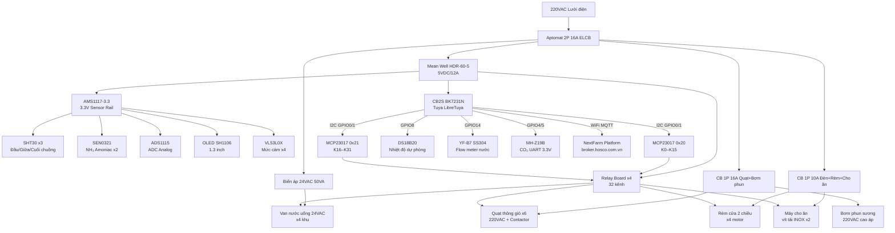

# 02 — Kiến Trúc Hệ Thống

---

## 2.0 Sơ Đồ Mermaid — Kiến Trúc Tổng Quan



---

## 2.1 Sơ Đồ Tổng Quan

```
┌────────────────────────────────────────────────────────────┐
│                  NEXTFARM PLATFORM                          │
│              IoT → Livestock Module                         │
└──────────────────────────┬─────────────────────────────────┘
                           │ MQTT / WiFi
              ┌────────────┴────────────┐
              │     CB2S (BK7231N)      │
              │     Tuya compatible      │
              └────────────┬────────────┘
                           │ I2C Bus (SDA/SCL)
           ┌───────────────┴──────────────────┐
           │                                  │
    ┌──────┴──────┐                   ┌───────┴──────┐
    │ MCP23017 #1 │                   │ MCP23017 #2  │
    │   (0x20)    │                   │   (0x21)     │
    │  Kênh 0–15  │                   │  Kênh 16–31  │
    └──────┬──────┘                   └───────┬──────┘
           │                                  │
    ┌──────┴──────────┐           ┌───────────┴──────────┐
    │  Relay Board    │           │    Relay Board        │
    │  1+2 (kênh 0-15)│           │    3+4 (kênh 16–31)  │
    └────────┬────────┘           └───────────┬───────────┘
             │                               │
   ┌─────────┴──────────┐         ┌──────────┴──────────┐
   │ 220VAC Load        │         │ 24VAC + 220VAC       │
   │ Bơm / Quạt         │         │ Van nước / Rèm       │
   │ Đèn / Bơm phun    │         │ Motor cho ăn          │
   └────────────────────┘         └─────────────────────┘
```

---

## 2.2 Luồng Dữ Liệu MQTT → NextFarm

```
NextFarm App / Platform
  │ Subscribe: livestock/{id}/status
  │ Subscribe: livestock/{id}/sensor
  │ Subscribe: livestock/{id}/alert   ← CẢNH BÁO NH₃, nhiệt độ
  │ Subscribe: livestock/{id}/lcd     ← Trạng thái màn hình
  │
  │ Publish: livestock/{id}/che_do/set
  │ Publish: livestock/{id}/quat/{i}/set
  │ Publish: livestock/{id}/suoi/{i}/set
  │ Publish: livestock/{id}/den/set
  │ Publish: livestock/{id}/choan/set
  ▼
CB2S Firmware → MCP23017 → Relay → Thiết bị
```

---

## 2.3 Màn Hình LCD & Hệ Thống Cảnh Báo

### Hiển Thị LCD 20×4

```
┌────────────────────┐
│AUTO  NH3:12p 28.5C │  ← Dòng 1: Chế độ + NH₃ + nhiệt độ
│Quat:3/6 DoAm:72%  │  ← Dòng 2: Số quạt đang chạy + độ ẩm
│Den:ON Suoi:OFF    │  ← Dòng 3: Đèn chiếu sáng + sưởi
│ChoAn:06:00 Cam:85%│  ← Dòng 4: Lịch cho ăn + % cám còn lại
└────────────────────┘

Khi có LỖI → LCD nhấp nháy + hiển thị lỗi:
┌────────────────────┐
│!!! CANH BAO !!!   │
│NH3 VUOT 25ppm:28p │
│Bat quat khan cap  │
│Kiem tra thong gio │
└────────────────────┘
```

### Cảnh Báo Lên App (MQTT Alert)

| Sự kiện | Mức | Nội dung gửi app |
|---------|:---:|-----------------|
| NH₃ > 25ppm | ⚠️ Vàng | "NH3 vuot nguong - bat quat khan cap" |
| NH₃ > 50ppm | 🔴 Đỏ | "NH3 NGUY HIEM - kiem tra ngay" |
| Nhiệt độ > 35°C (gà thịt) | ⚠️ Vàng | "Nhiet do cao - kiem tra he thong lam mat" |
| Nhiệt độ < 28°C (gà con) | ⚠️ Vàng | "Nhiet do thap - bat den suoi" |
| CO₂ > 3000ppm | ⚠️ Vàng | "CO2 cao - tang thong gio" |
| Mức cám < 20% | ℹ️ Xanh | "Can bo sung thuc an" |
| Mức cám < 5% | 🔴 Đỏ | "HET CAM - can bo sung ngay" |
| Mất kết nối WiFi | ⚠️ Vàng | "Mat ket noi WiFi" |
| Phục hồi mất điện | ℹ️ Xanh | "He thong phuc hoi sau mat dien" |

---

## 2.4 Logic Điều Khiển Tự Động

### Thông Gió — 6 Cấp Độ Theo Nhiệt Độ

```
Nhiệt độ < Ngưỡng thấp:  Tắt tất cả quạt
Nhiệt độ ≥ T1:           Bật Q1+Q2 (2 quạt)
Nhiệt độ ≥ T2:           Bật Q1+Q2+Q3+Q4 (4 quạt)
Nhiệt độ ≥ T3:           Bật tất cả Q1–Q6 (6 quạt)
Nhiệt độ ≥ T4:           6 quạt + bơm phun sương
Nhiệt độ ≥ T5:           6 quạt + phun sương + tấm làm mát

NH₃ > 25ppm:             Bật TẤT CẢ quạt (ưu tiên tuyệt đối)
NH₃ > 50ppm:             Tất cả quạt + CẢNH BÁO app
```

### Sưởi Ấm — Theo Nhiệt Độ Mục Tiêu

```
Cài đặt nhiệt độ mục tiêu theo tuần tuổi:
  Tuần 1: 35°C | Tuần 2: 32°C | Tuần 3: 29°C | Tuần 4+: 26°C

Logic:
  Nhiệt độ < (mục tiêu - 1°C) → Bật đèn sưởi
  Nhiệt độ > (mục tiêu + 1°C) → Tắt đèn sưởi
  (Hysteresis ±1°C để tránh bật/tắt liên tục)
```

### Chiếu Sáng — Quang Chu Kỳ

```
Gà đẻ: 16h sáng → Bật 05:00, Tắt 21:00
Gà thịt: 23h sáng → Bật 04:00, Tắt 03:00 hôm sau
Gà con: Bật liên tục tuần 1, giảm dần theo tuổi
Cấu hình qua MQTT từ app
```

### Cho Ăn Tự Động

```
3 lần/ngày: 06:00, 11:00, 16:00
Motor chạy: 20–60 giây/lần (cài đặt được)
Cảnh báo: Mức cám < 20% → App
Dừng khẩn: Lệnh MQTT hoặc nút vật lý
```

---

## 2.5 Cấu Trúc Phần Mềm

```
chan-nuoi.ino
│
├── setup()
│   ├── initI2C() + mcp1/2.begin_I2C()
│   ├── tatTatCaRelay()
│   ├── loadConfig()
│   ├── WiFiManager.autoConnect()
│   ├── configTzTime(NTP)
│   ├── connectMQTT()
│   └── kiemTraPhucHoi()
│
└── loop()
    ├── mqtt.loop()
    ├── docCamBien() [30s]
    │   ├── SHT30 nhiệt độ + độ ẩm (3 điểm)
    │   ├── MQ-135 NH₃
    │   ├── MH-Z19B CO₂ (UART)
    │   ├── HX711 cân
    │   └── HC-SR04 mức cám
    ├── kiemTraQuat() [30s]     ← Theo nhiệt độ + NH₃
    ├── kiemTraSuoi() [30s]     ← Theo nhiệt độ mục tiêu
    ├── kiemTraLamMat() [30s]   ← Phun sương + tấm làm mát
    ├── kiemTraLichChoAn() [60s]← Lịch cho ăn
    ├── kiemTraQuangChuKy() [60s]← Lịch chiếu sáng
    ├── capNhatLCD() [2s]
    ├── kiemTraCanh Bao() [10s] ← NH₃, nhiệt độ, cám
    └── publishStatus() [5s]
```

---

## 2.6 Nguồn Điện

```
220VAC
  │
[Aptomat 2P 16A ELCB]
  │
  ├── [Mean Well HDR-60-5] → 5VDC → CB2S + MCP23017 + Relay coil
  ├── [Biến áp 24VAC 50VA] → 24VAC → 4 van nước uống
  ├── [Aptomat 1P 6A] → Bơm chính (qua Contactor)
  ├── [Aptomat 1P 16A] → 6 Quạt + 2 Bơm làm mát
  └── [Aptomat 1P 10A] → Đèn sưởi + Đèn chiếu sáng + Motor rèm + Máy cho ăn
```

---

*[← Tổng Quan](01_tong-quan.md) | [Phần Cứng →](03_phan-cung.md)*
